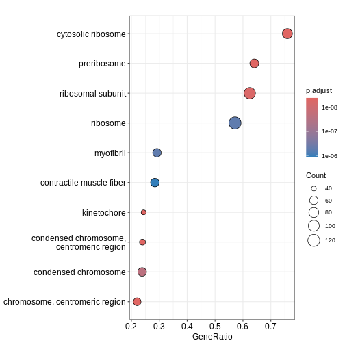

:::::::::::::::::::::::::::::::::::::: questions 

- What are the different types of GO terms (BP, MF, CC)?
- How do we perform ORA using `enrichGO()` function?
-	How can we run GSEA-style functional class scoring with `gseGO()` function?


::::::::::::::::::::::::::::::::::::::::::::::::

::::::::::::::::::::::::::::::::::::: objectives

- Apply GO-based enrichment methods using `clusterProfiler`
- Perform both ORA and GSEA using the GO terms database
- Build confidence in navigating GO resources and interpreting enriched terms 

::::::::::::::::::::::::::::::::::::::::::::::::

## Introduction

The Gene Ontology (GO) project is a major bioinformatics initiative that standardises how we describe gene functions across species, organising them into three categories: Biological Process, Molecular Function and Cellular Component. `clusterProfiler` is an R package that allows us to test whether these GO terms are associated with our RNA-seq results and gain insight into the pathways or functions represented in our data. This section demonstrates how to perform both **over-representation analysis (ORA)** and **functional class scoring (FCS)** with GO database, depending on whether you are working with a list of significant genes or full ranked expression data. 

## Over-Representation Analysis (ORA)

**ORA** tests whether a list of significant genes are linked to specific GO terms. The input is a vector of gene IDs (or list of genes) that passes your differential expression cut-off. ORA can be run separately for downregulated and upregulated genes to reveal which GO terms are enriched in each direction.

We first subset the `debasal` dataset to extract genes with adjusted p-value below 0.01 and store this set of significant genes in an object called `genes`. We then run enrichGO function using this gene list, specifying the organism database `org.Mm.eg.db`, the identifier type `ENTREZID` and the GO category of interest `CC` (for cellular component). The function is configured with standard p-value and q-value, using Benjamini-Hochberg correction. We use the function `head()` to check the first few lines of output. 


``` r
debasal$Status <- debasal$adj.P.Val < 0.01
gene <- debasal$ENTREZID[debasal$Status]

ego <- enrichGO(gene = gene,
                OrgDb = org.Mm.eg.db,
                keyType = 'ENTREZID',
                ont = "CC",
                pAdjustMethod = "BH",
                pvalueCutoff = 0.01,
                qvalueCutoff = 0.05,
                readable = TRUE)
head(ego)
```

``` output
                   ID                       Description GeneRatio   BgRatio
GO:0022626 GO:0022626                cytosolic ribosome   69/2803 123/25856
GO:0030684 GO:0030684                       preribosome   62/2803 104/25856
GO:0032040 GO:0032040          small-subunit processome   44/2803  73/25856
GO:0044391 GO:0044391                 ribosomal subunit   70/2803 190/25856
GO:0005819 GO:0005819                           spindle  119/2803 447/25856
GO:0022627 GO:0022627 cytosolic small ribosomal subunit   28/2803  37/25856
           RichFactor FoldEnrichment   zScore       pvalue     p.adjust
GO:0022626  0.5609756       5.174665 16.18263 9.782230e-35 7.336672e-32
GO:0030684  0.5961538       5.499163 16.03109 1.830332e-33 6.863746e-31
GO:0032040  0.6027397       5.559914 13.60415 1.998226e-24 4.995565e-22
GO:0044391  0.3684211       3.398464 11.57047 2.777704e-21 5.208196e-19
GO:0005819  0.2662192       2.455713 10.82570 4.799528e-21 7.199292e-19
GO:0022627  0.7567568       6.980629 12.69399 3.946946e-20 4.933682e-18
                 qvalue
GO:0022626 5.127948e-32
GO:0030684 4.797397e-31
GO:0032040 3.491637e-22
GO:0044391 3.640255e-19
GO:0005819 5.031926e-19
GO:0022627 3.448384e-18
                                                                                                                                                                                                                                                                                                                                                                                                                                                                                                                                                                                                                                                                                                                                                                          geneID
GO:0022626                                                                                                                                                                                                                                                                                                                                       Rplp1/Rpsa/Usp10/Rpl12/Rps19/Rplp0/Rps16/Rpl41/Rplp2/Rpl10a/Rps5/Rpl8/Rps27a/Rps24/Rpl36/Rps25/Rpl23a/Rpl4/Ppargc1a/Rpl18a/Rpl13a/Rpl15/Rps26/Rpl5/Rps3/Rpl18/Rpl19/Rps15/Rps8/Rpl32/Rpl31/Rps7/Rpl27/Rpl7a/Rps3a1/Abce1/Rpl37rt/Rpl11/Rps18/Rpl26/Rpl34/Zfp598/Rpl23/Rps21/Rps20/Rps17/Rpl6/Rpl14/Rps4x/Rps15a/Rps9/Rps10/Gspt1/Rps11/Metap1/Rps29/Rpl3/Rps14/Rps23/Rpl10/Rps2/Rpl35/Rpl36a/Rpl21/Rps28/Etf1/Rps12/Rpl22/Rpl24
GO:0030684                                                                                                                                                                                                                                                                                                                                                                                        Wdr43/Nob1/Fbl/Ppan/Rcl1/Utp4/Rrp9/Ftsj3/Rrp1b/Rrp15/Noc2l/Rrs1/Nip7/Srfbp1/Nat10/Riok1/Rps19/Rps16/Heatr1/Nop56/Tbl3/Utp25/Nol6/Mrto4/Mphosph10/Rps5/Rps27a/Rps24/Bysl/Noc4l/Rps8/Utp15/Rps7/Dhx37/Rps3a1/Mak16/Krr1/Pno1/Pes1/Wdr46/Rps17/Pwp2/Rps4x/Rps15a/Rps9/Rps11/Wdr74/Ltv1/Rps14/Rps23/Utp18/Rps19bp1/Wdr75/Utp14b/Prkdc/Nop14/Rps28/Ebna1bp2/Riok2/Dimt1/Rps12/Wdr36
GO:0032040                                                                                                                                                                                                                                                                                                                                                                                                                                                                                                 Wdr43/Fbl/Rcl1/Utp4/Rrp9/Nat10/Rps19/Rps16/Heatr1/Nop56/Tbl3/Utp25/Nol6/Mphosph10/Rps5/Rps27a/Rps24/Noc4l/Rps8/Utp15/Rps7/Dhx37/Rps3a1/Krr1/Pno1/Wdr46/Rps17/Pwp2/Rps4x/Rps15a/Rps9/Rps11/Rps14/Rps23/Utp18/Rps19bp1/Wdr75/Utp14b/Prkdc/Nop14/Rps28/Dimt1/Rps12/Wdr36
GO:0044391                                                                                                                                                                                                                                                                                                                                Rplp1/Rpsa/Rpl12/Npm1/Rps19/Rplp0/Rps16/Rpl41/Rack1/Rplp2/Rpl10a/Rps5/Rpl8/Rps27a/Rps24/Rpl36/Rps25/Rpl23a/Rpl4/Rpl18a/Rpl13a/Rpl15/Mrpl52/Rps26/Rpl5/Rps3/Rpl18/Rpl19/Rps15/Rps8/Rpl32/Rpl31/Rps7/Rpl27/Rpl7a/Rps3a1/Rpl37rt/Rpl11/Rps18/Rpl26/Rpl34/Rpl23/Rps21/Rps20/Rps17/Rpl6/Rpl14/Rps4x/Rps15a/Mrps30/Rps9/Rps10/Rps11/Mrpl12/Rps29/Mrpl17/Rpl3/Rps14/Rps23/Rpl10/Rps2/Rpl35/Rpl36a/mt-Rnr2/Rpl21/Rps28/Ptcd3/Rps12/Rpl22/Rpl24
GO:0005819 Fam110a/Adrb2/Gpsm2/Nedd9/Rassf10/Cep350/Nsun2/Rps6ka2/Ckap2/Diaph3/Parp4/Luzp1/Kif23/Champ1/Kif15/Slc25a5/Npm1/Ckap2l/Kif11/Arhgef2/Kntc1/Gsk3b/Nek6/Mapre3/Hspa2/Spag5/Tmem201/Rangap1/Tppp/Clasp1/Mapk14/Tpx2/Rps3/Ctdp1/Map4/Kifc1/Afg2a/Hnrnpu/Cdk1/Wdr5/Ckap5/Clasp2/Mtcl1/Nek7/Shcbp1/Kif2a/Lzts2/Git1/Invs/Racgap1/Dzip1l/Tacc3/Kif14/Cdk5rap2/Eml4/Haus4/Ino80/Chmp3/Arl8a/Nusap1/Aurkb/Kmt5b/Prc1/Zzz3/Ect2/Tbccd1/Ccsap/Kat2b/Prpf19/Cenpf/Hmmr/Anxa11/Plk1/Ncor1/Pmf1/Topors/Kif22/Tbl1x/Plekhg6/Ddx11/Ccdc66/Kif2c/Ska1/Hecw2/Mad2l1/Ercc2/Kif20a/Dlgap5/Espl1/Ikbkg/Unc119/Ccnb1/Kif18b/Knstrn/Ralbp1/Cdc20/Cdca8/Mical3/Dctn1/Gem/Cltc/Spice1/Cenpe/Rcc2/Birc5/Cspp1/Bub1b/Dpysl2/Sirt2/Tubb2a/Pard3/Cep63/Cep170/Ppp2cb/Spdl1/Sgo1/Nup62/Cdc27/Csnk1d
GO:0022627                                                                                                                                                                                                                                                                                                                                                                                                                                                                                                                                                                                                   Rpsa/Rps19/Rps16/Rps5/Rps27a/Rps24/Rps25/Rps26/Rps3/Rps15/Rps8/Rps7/Rps3a1/Rps18/Rps21/Rps20/Rps17/Rps4x/Rps15a/Rps9/Rps10/Rps11/Rps29/Rps14/Rps23/Rps2/Rps28/Rps12
           Count
GO:0022626    69
GO:0030684    62
GO:0032040    44
GO:0044391    70
GO:0005819   119
GO:0022627    28
```

We can then use `dotplot()` function to visualise the results in the form of a dot plot. From the plot below, we can see that GO term cellular component spindle, membrane microdomain and ribosome are top enriched terms.


``` r
dotplot(ego)
```


::::: challenge

Challenge! Can you identify enriched GO term biological process in `deluminal` dataset? Are the enriched pathways similar?

:::::
## Gene Set Enrichment Analysis (GSEA)

We can also perform **GSEA** using GO database. GSEA is a type of functional class scoring method that evaluates whether genes belonging to a GO term tend to appear at the top or bottom of a ranked gene list, rather than relying on a cut-off (i.e. adj.P.Val < 0.01). The input is a continuous ranking metric (e.g. log2FC) for all genes. This allows the detection of subtle but coordinated shifts in GO terms for both downregulated and upregulated pathways. 

We begin by creating a ranked gene list for GSEA by extracting the logFC values from `debasal` dataset and its corresponding `ENTREZID`. We then sort this vector in a decreasing order so that the upregulated genes appear at the top of the list and the downregulated genes at the bottom. Using this ranked gene list, we run `gseGO()` to perform GSEA on GO terms `CC`, by specifying the organism database, gene ID type, gene set limits and p-value cut-off for enrichment. 


``` r
debasal_genelist <- debasal$logFC
names(debasal_genelist) <- debasal$ENTREZID
debasal_genelist <- sort(debasal_genelist, decreasing = TRUE)

ego3 <- gseGO(gene          = debasal_genelist,
                OrgDb         = org.Mm.eg.db,
                keyType       = 'ENTREZID',
                ont           = "CC",
              minGSSize    = 100,
              maxGSSize    = 500,
              pvalueCutoff = 0.05,
              verbose      = FALSE)
head(ego3)
```

``` output
                   ID                              Description setSize
GO:0030684 GO:0030684                              preribosome     103
GO:0022626 GO:0022626                       cytosolic ribosome     108
GO:0000779 GO:0000779 condensed chromosome, centromeric region     175
GO:0000776 GO:0000776                              kinetochore     164
GO:0000775 GO:0000775           chromosome, centromeric region     240
GO:0044391 GO:0044391                        ribosomal subunit     173
           enrichmentScore      NES       pvalue     p.adjust       qvalue rank
GO:0030684       0.6638177 2.374210 1.000000e-10 3.300000e-09 2.210526e-09 3377
GO:0022626       0.6468668 2.319974 1.000000e-10 3.300000e-09 2.210526e-09 4038
GO:0000779       0.5655402 2.175755 1.000000e-10 3.300000e-09 2.210526e-09 1254
GO:0000776       0.5705673 2.173409 1.000000e-10 3.300000e-09 2.210526e-09 1254
GO:0000775       0.5303003 2.089947 1.000000e-10 3.300000e-09 2.210526e-09 1417
GO:0044391       0.5545608 2.127601 2.940071e-10 8.085195e-09 5.415920e-09 4724
                             leading_edge
GO:0030684 tags=64%, list=21%, signal=51%
GO:0022626 tags=76%, list=26%, signal=57%
GO:0000779  tags=24%, list=8%, signal=22%
GO:0000776  tags=24%, list=8%, signal=23%
GO:0000775  tags=22%, list=9%, signal=20%
GO:0044391 tags=62%, list=30%, signal=44%
                                                                                                                                                                                                                                                                                                                                                                                                                                                                                                                                                                                                                                                                                      core_enrichment
GO:0030684                                                                                                                                                                                                                                                                 72515/59028/14113/235036/67223/72462/215193/59014/67973/67619/98956/27966/217995/56095/57741/67222/69902/66538/67134/213773/21771/105372/66164/53414/67920/78294/71340/208144/57750/107071/20085/110816/57315/52705/230082/20055/20115/20116/217109/20103/20088/64934/66249/68052/66254/100608/54127/20091/67045/20042/73674/353258/20068/76846/72554/267019/20102/20044/27207/69072/195434/225348/14791/57294/66475/27993
GO:0022626                                                                                                                                                             16785/56040/269261/22224/20084/19982/68436/22186/78294/67186/67097/20085/67671/20055/19951/11837/100503670/20115/27367/20116/54217/27370/76808/20103/270106/268449/20088/19896/67025/68052/20090/75617/24015/20054/27050/54127/26961/67115/67891/67945/114641/22121/19946/20091/19899/20042/66489/100502825/67427/75624/213753/66480/66481/65019/19921/20068/19988/19933/76846/267019/20102/20044/27207/19981/19942/14852/19941/57294/66475/19944/225363/27176/57808/16898/19934/110954/68193/11815/67281/207214/105083/319195
GO:0000779                                                                                                                                                                                                                                                                                                                                                                                                                       20877/12235/66468/66977/54392/66570/108000/67629/12236/76464/208628/26886/12615/268697/18817/102920/54141/67052/18005/60411/107995/72415/68549/70385/22137/11799/73804/51944/72155/229841/381318/71876/68014/67177/56150/69928/66934/66442/67037/19387/101994/236930
GO:0000776                                                                                                                                                                                                                                                                                                                                                                                                                                   20877/12235/66468/66977/66570/108000/67629/12236/76464/208628/26886/268697/18817/102920/54141/67052/18005/60411/107995/72415/68549/70385/22137/11799/73804/51944/72155/229841/381318/71876/68014/67177/56150/69928/66934/66442/67037/19387/101994/236930
GO:0000775                                                                                                                                                                                                                                                                                                                                                20877/12235/66468/66977/54392/66570/108000/52276/67629/72107/12236/70645/76464/208628/26886/12615/71988/268697/18817/102920/54141/67052/18005/60411/217653/107995/72415/68549/70385/22137/11799/73804/51944/21973/72155/229841/381318/217578/71876/68014/67177/56150/17345/69928/66934/66442/67037/19387/101994/236930/319160/218973/219114
GO:0044391 16785/56040/269261/20084/56282/19982/66973/68436/22186/78294/67186/67097/20085/67671/20055/18148/19951/11837/100503670/20115/14694/68836/27367/20116/54217/27370/76808/20103/270106/268449/20088/19896/67025/68052/20090/75617/69163/20054/27050/54127/26961/67115/67891/67945/114641/22121/19946/20091/19899/20042/66489/59054/100502825/67427/60441/66480/66481/65019/19921/27397/20068/118451/19988/19933/76846/267019/69956/79044/20102/20044/27207/78523/19981/19942/66230/19941/57294/66475/19944/94063/27176/57808/16898/102060/66258/19934/110954/28028/68193/75398/67281/207214/319195/50529/26451/66121/14109/19989/20104/64657/64655/66407/20005/94065/216767/67840/67308/19943
```

``` r
dotplot(ego3)
```



We can also use the `gseaplot()` function to visualise GSEA result for a specific gene set. In this example, we select the top-ranked enriched GO term (geneSetID = 1). The result-ing plot displays how genes contributing to the enrichment of this GO term are distributed in the ranked gene list. 


``` r
gseaplot(ego3, by = "all", title = ego3$Description[1], geneSetID = 1)
```


::::::::::::::::::::::::::::::::::::: keypoints 

- GO terms are divided into Biological Process (BP), Molecular Function (MF) and Cellular Component (CC), which can be analysed separately or together depending on the biological question.
- The `enrichGO()` and `gseGO()` functions in `clusterProfiler` allow users to perform **ORA** and **GSEA** using the GO database directly.
- GO testing results highlight gene sets or pathways that are overrepresented in your dataset, allowing interpretation of downregulated or upregulated genes.

::::::::::::::::::::::::::::::::::::::::::::::::

