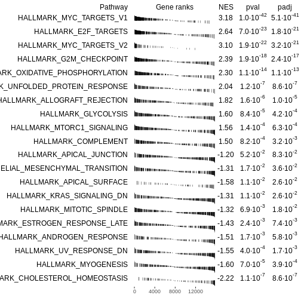
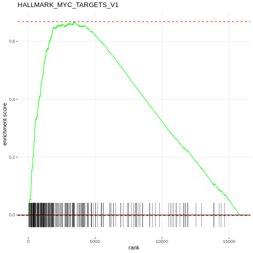

:::::::::::::::::::::::::::::::::::::: questions 

- hello!

::::::::::::::::::::::::::::::::::::::::::::::::

::::::::::::::::::::::::::::::::::::: objectives

- To learn

::::::::::::::::::::::::::::::::::::::::::::::::


## Gene Set Enrichment Analysis with `fgsea`

Now, let's perform Gene Set Enrichment Analysis using the `fgsea` package.


``` r
 #Prepare ranked list of genes
rankedgenes_df <- debasal[order(debasal$t, decreasing = FALSE), c("ENTREZID", "t")]
rankedgenes <- rankedgenes_df$t
names(rankedgenes) <- rankedgenes_df$ENTREZID

# Perform fgsea
fgseaRes <- fgsea(pathways = Mm.H, stats = rankedgenes, minSize = 15)


# Plot
# Code from vignette

topPathwaysUp <- fgseaRes[ES > 0][head(order(pval), n=10), pathway]
topPathwaysDown <- fgseaRes[ES < 0][head(order(pval), n=10), pathway]
topPathways <- c(topPathwaysUp, rev(topPathwaysDown))
plotGseaTable(Mm.H[topPathways], rankedgenes, fgseaRes, 
              gseaParam=0.5)
```



``` r
# Plot the top pathway

plotEnrichment(Mm.H[[topPathwaysUp[1]]], rankedgenes) + labs(title = topPathwaysUp[1])
```




::::::::::::::::::::::::::::::::::::: keypoints 

- Use `.md` files for episodes when you want static content
- Use `.Rmd` files for episodes when you need to generate output
- Run `sandpaper::check_lesson()` to identify any issues with your lesson
- Run `sandpaper::build_lesson()` to preview your lesson locally

::::::::::::::::::::::::::::::::::::::::::::::::

